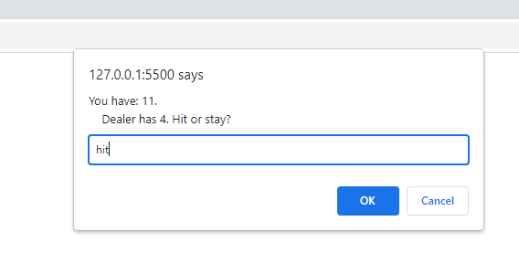

# Blackjack
Using Javascript to create an interactive prompt-box game modelled on the classic card game Blackjack, also known as "21".

## Description

The aim of the project is to use objects, functions, conditional logic, and loops to create an iterable version of the game "Blackjack".
The user pits themselves against a "dealer", the computer, and tries to get as close to the target number of 21 as possible, without exceeding 21.

## Installation

N/A

## Usage

The way to use the deployed application is to interact with the prompt boxes which appear on screen. The user types "hit" or "stay" to decide whether they
wish to receive another card, or to stop receiving cards.

## Screenshot Of Deployed Application

## Credits

N/A

## License

Please refer to the license in the repo (MIT License).